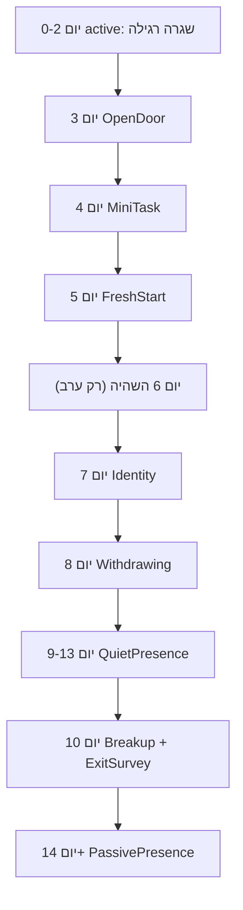

# מפרט: מערכת נטישה והחזרת משתמשים (Churn / Re-engagement)

> **מסמך אפיון.** נכתב כדי שאפשר יהיה לאשר את המערכת לפני יישום, ולפתוח אותו
> ממחשב חדש בלי להסתמך על זיכרון השיחה.
>
> תאריך: 7 ביוני 2026. סטטוס: **טרם הוחל יישום** — מסמך אפיון בלבד.
>
> מקורות: הצעות Claude + Gemini, מאוחדים ומותאמים לקוד הקיים של NuraWell.

---

## 0. TL;DR

NuraWell כבר מזהה משתמשים שנעלמו ומשנה **תדירות** ו**טון** של הודעות אלמוג
החל מיום 3 ללא תגובה אמיתית. מה שחסר הוא **שכבת אסטרטגיית תוכן** — מהלכים
פסיכולוגיים מדורגים (Mini-Task, Fresh Start, Identity Reconnection, פרידה
פרדוקסלית), **persistence** של מצב מעורבות, **Exit Survey** לסיבות נטישה,
ו-**Passive Presence** אחרי הפרידה.

**עיקרון מנחה:** לא לבנות מערכת חדשה — להוסיף 4 שכבות **מעל** מכונת המצבים
הקיימת (`cadenceStage`, `urgencyLevel`, `eveningLongingTier`).

**זיהוי נטישה:** מיום **3** (לא יום 8). "פעיל" = תגובה אמיתית (צ'אט או סימון
משימה), לא פתיחת אפליקציה.

---

## 1. רקע ומצב קיים בקוד

### 1.1 מה כבר עובד

| רכיב | קובץ | מה עושה |
|------|------|---------|
| Cron habit checkpoints | `apps/web/app/api/v1/ai/cron/habit-checkpoints/route.ts` | 3× ביום (בוקר/צהריים/ערב), בוחר מועמדים ומפעיל Workflow |
| Batch planner | `apps/web/lib/workflows/habit-checkpoint-batch.ts` | מחשב `cadenceStage`, `nudgeLevel`, `urgencyLevel`, `daysSinceLastActive` |
| Workflow | `apps/web/app/api/workflows/almog-habit-checkpoint/route.ts` | Gate + שליחה |
| שליחה + LLM | `apps/web/lib/workflows/send-almog-habit-checkpoint.ts` | בונה prompt, קורא LLM, מכניס ל-`notifications`, Web Push |
| Prompt rules | `apps/web/lib/ai/habit-checkpoint-llm.ts` | `behavioralRule`, `eveningLongingTier`, הנחיות טון לפי שלב |
| Voice DNA | `apps/web/lib/ai/prompts.ts` | `ALMOG_VOICE_DNA` — קול המנטור |
| Master cron (legacy) | `apps/web/app/api/v1/ai/cron/master/route.ts` | re_engage, crisis_reconnect, micro_win — לפי `last_active_at` |
| Cron ops | `apps/web/lib/ai/cron-ops-action.ts` | החלטות `re_engage` / `crisis_reconnect` / `micro_win` |

### 1.2 מכונת cadence קיימת

```text
active            (0–2d):   3/יום (בוקר + צהריים + ערב)
dormant_early     (3–7d):   2/יום (בוקר + ערב)
withdrawing       (8d):     1/יום (רק בוקר)
extended_absence  (9–13d):  1/יום (רק צהריים)
ghosted           (14+d):   1/שבוע (cooldown 7 ימים)
```

מקור: `computeCadenceStage()` ב-`habit-checkpoint-batch.ts`.

### 1.3 הגדרת "פעיל" (SSOT)

`fetchTrueLastActiveByUser()` מחשב את MAX של:

1. `ai_interactions.created_at` WHERE `role = 'user'`
2. `journey_task_executions.completed_at`

**לא** משתמשים ב-`profiles.last_active_at` (מנופח ע"י middleware / Service Worker).

רצפה: `profiles.created_at` — משתמש חדש שלא ענה לא נחשב Ghosted מיידית.

### 1.4 ערוצי מסירה

1. **In-app:** insert ל-`notifications` + Supabase Realtime
2. **Web Push:** `profiles.ai_context.web_push` (אופציונלי)
3. **Email / WhatsApp:** לא בשימוש להודעות mentor כרגע

### 1.5 מה חסר (ה-gap)

| חסר | השפעה |
|-----|--------|
| `reengagementMove` — מהלך תוכן ייעודי לפי יום | הטון מתרכך אבל האסטרטגיה לא משתנה |
| Persistence של `engagement_status` | אין analytics, אין gating מדויק |
| שימוש ב-`main_goal` / `main_obstacle` בהחזרה | Identity Reconnection לא אפשרי |
| Exit Survey | אין נתונים על סיבות נטישה |
| Passive Presence מובנה | אחרי ghosted — רק cooldown, בלי value drop / triggers |
| איחוד master cron + habit checkpoints | שני מנגנונים מקבילים עם מקורות פעילות שונים |

### 1.6 הנחות מוצר

- **"מנוי פעיל":** אין billing/Stripe בקוד. כרגע = `enrollments.is_active = true`
  לקורס הרלוונטי + `profiles.is_active = true`.
- **Voice:** כל הניסוחים בעברית, בקול אלמוג (`ALMOG_VOICE_DNA`). הדוגמאות
  במסמך הן **לרוח בלבד** — ה-LLM חייב לייצר ניסוח מקורי (חוק קריטי בפרומפט).

---

## 2. עקרונות פסיכולוגיים

### 2.1 חלון ההזדמנות — אל תאשים, תפתח דלת

**בעיה:** המשתמש מרגיש אשמה על נטישה. הודעה שמוסיפה לחץ → סגירה נוספת.

**יישום ב-NuraWell:**
- יום 3: **Open Door** — שאלה רכה, **בלי** להזכיר משימות / היעלמות / "לא עדכנת".
- אסור: "ראיתי שלא עשית", "מצפים ממך" (כבר מוגדר ב-`behavioralRule`).

### 2.2 Fresh Start Effect

**מקור:** Dai et al., Wharton — אנשים חוזרים להרגלים אחרי "נקודת ציון" (שני,
ראש חודש, תאריך עגול).

**יישום:** יום 5 — **Fresh Start Offer** — "שבוע חדש, נקי, צעד אחד ביום".
אם המשתמש מקבל → רישום ב-`ai_context.reengagement.fresh_start_offered_at`
+ אופציונלי: reset סמלי של `streak_days` / `habit_meta` (לא מחיקת התקדמות).

### 2.3 Identity Reconnection

**מקור:** Self-Determination Theory — חזרה דרך מוטיבציה **פנימית**, לא חיצונית.

**יישום:** יום 7 — שולף מ-`profiles`:
- `main_goal` → `weight_loss` / `healthy_lifestyle` / `both`
- `main_obstacle` + `main_obstacle_detail`
- `ai_system_prompt` (אם קיים — מילים של המשתמש)

**מיפוי עברית:**

| שדה | ערכים | ניסוח לפרומפט |
|-----|-------|---------------|
| `main_goal` | `weight_loss` | "ירידה במשקל / להרגיש קל יותר" |
| | `healthy_lifestyle` | "אורח חיים בריא / הרגלים טובים" |
| | `both` | "גם משקל וגם בריאות כללית" |
| `main_obstacle` | `no_time` | "אין זמן" |
| | `emotional_eating` | "אכילה רגשית" |
| | `lack_of_consistency` | "קושי בעקביות" |
| | `no_support` | "חוסר תמיכה" |
| | `other` | `main_obstacle_detail` |

### 2.4 Lowering the Bar — הורדת חיכוך לאפס

**יישום:** יום 4 — **Mini-Task** — שאלת כן/לא של ~10 שניות.
עיקרון Foot-in-the-door: תגובה קטנה = פתיחה לתגובה גדולה יותר.

דוגמאות (לרוח): "שתית מים הבוקר?", "אכלת משהו?", "יש לך דקה?"

### 2.5 Loss Aversion (Gemini)

**יישום:** יום 7 (Identity) + יום 10 (Breakup) — שיקוף הישגים לפני הנפילה:
`streak_days`, משימות שהושלמו, צעד נוכחי במסע. **לא** כלחץ — כ"זה עדיין שמור".

### 2.6 Reactance Theory — פרידה פרדוקסלית

**יישום:** יום 10 — **Breakup** — "מפסיק תזכורות יומיות, אני כאן כשתחזור".
מפסיק לדחוף → מחזיר שליטה → מגדיל סיכוי לחזרה מרצון.

### 2.7 Autonomy — אשליית השליטה (Gemini)

**יישום:** אופציונלי ביום 5 (Fresh Start) — "רוצה שאקפיא את התוכנית לכמה
ימים?" — מכריח תגובה גם אם רק כדי לאשר הקפאה. נשמר ב-`ai_context.reengagement.pause_offered_at`.

---

## 3. הגדרת מצבי מעורבות וזיהוי נטישה

### 3.1 שני מושגים — cadence מול engagement_status

| מושג | שימוש | איפה |
|------|-------|------|
| `cadenceStage` | תדירות + טון prompt | קיים, runtime בלבד |
| `engagement_status` | analytics, gating, דוחות | **חדש**, persisted ב-DB |

### 3.2 מיפוי engagement_status

```text
active     — 0–1 ימים ללא תגובה (שגרה)
slipping   — 2 ימים (concerned tone, cadence עדיין active)
at_risk    — 3–6 ימים (פרוטוקול re-engagement מופעל)
dormant    — 7–13 ימים (withdrawing + extended_absence + breakup)
churned    — 14+ ימים (ghosted + passive presence)
```

עדכון: בכל הרצת habit-checkpoints cron, אחרי `fetchTrueLastActiveByUser`.

### 3.3 reengagementMove — מהלכי תוכן

```typescript
type ReengagementMove =
  | 'none'              // שגרה / completion override / יום 6 השהיה
  | 'open_door'         // יום 3
  | 'mini_task'         // יום 4
  | 'fresh_start'       // יום 5
  | 'identity'          // יום 7
  | 'withdrawing'       // יום 8 (קיים cadence, move חדש לפרומפט)
  | 'quiet_presence'    // יום 9–13 (extended_absence)
  | 'breakup'           // יום 10 (פעם אחת) — נושא בתוכו את ה-Exit Survey
  | 'passive_soft'      // 14+ שבועי
  | 'passive_value'     // 14+ חודשי
  | 'passive_trigger';  // 14+ אירוע מיוחד
```

> **הערה (כיול פסיכולוגי):** אין move נפרד של `exit_survey`. בקשת סיבת הנטישה
> **חייבת** להגיע רק בשלב ניתוק המגע (יום 10, `breakup`), לא לפני. הסיבה:
> Self-Perception Theory — אם גורמים למשתמש לנסח *למה עזב* בזמן שעוד מנסים
> להציל אותו (יום 6), הוא בונה רציונליזציה לנטישה ומשכנע את עצמו שזו החלטה
> סופית — מה ששורף את מהלך ה-Identity של יום 7. הסקר רוכב על `breakup` ברמת
> ה-`metadata.survey` + ה-UI, ראה סעיף 4.8 ו-7.

### 3.4 חוקי gating למהלכים

1. כל move נשלח **פעם אחת** (מעקב ב-`ai_context.reengagement.sent_moves[]`).
2. moves ייעודיים נשלחים ב-**slot בוקר** בלבד (חוץ מ-`quiet_presence` = midday,
   `passive_*` = לפי לוח נפרד).
3. אם המשתמש **הגיב** אחרי move → **reset** ל-`active`, ניקוי `sent_moves`
   (אופציונלי: שמירת היסטוריה ב-`sent_moves_archive`).
4. `completionStatus === 'full' | 'partial'` → **גובר** על move — חוגגים/מדרבנים.
5. `isAvoidPushActive(ai_context)` → **silent** (קיים ב-`avoid-push.ts`).
6. `isUserRespondedRecently(hours < 6)` → דילוג על slot (קיים).

### 3.5 computeReengagementMove — לוגיקה מוצעת

```typescript
function computeReengagementMove(params: {
  daysSinceLastActive: number;
  slot: HabitCheckpointSlot;
  sentMoves: ReengagementMove[];
  cadenceStage: HabitCheckpointCadenceStage;
  breakupSentAt: string | null;
}): ReengagementMove {
  const { daysSinceLastActive: d, slot, sentMoves, breakupSentAt } = params;

  if (d >= 14) {
    // Passive presence — נקבע ב-cron נפרד או כאן לפי trigger
    return 'none'; // cron passive route יטפל
  }

  // יום 10: Breakup נושא בתוכו גם את ה-Exit Survey (metadata.survey + UI)
  if (d === 10 && !sentMoves.includes('breakup') && slot === 'morning') {
    return 'breakup';
  }
  if (d >= 9 && d <= 13) return slot === 'midday' ? 'quiet_presence' : 'none';
  if (d === 8 && slot === 'morning') return 'withdrawing';
  if (d === 7 && slot === 'morning' && !sentMoves.includes('identity')) return 'identity';
  // יום 6 הוסר בכוונה — השהיה בבוקר. רק נוכחות ערב רכה (eveningLongingTier).
  // אסור לשאול "למה עזבת" לפני מהלך ה-Identity של יום 7 (Self-Perception Theory).
  if (d === 5 && slot === 'morning' && !sentMoves.includes('fresh_start')) return 'fresh_start';
  if (d === 4 && slot === 'morning' && !sentMoves.includes('mini_task')) return 'mini_task';
  if (d === 3 && slot === 'morning' && !sentMoves.includes('open_door')) return 'open_door';

  return 'none';
}
```

---

## 4. הפרוטוקול המלא — יום אחר יום

### סיכום ויזואלי



| יום | cadenceStage | move | slot | מטרה |
|-----|--------------|------|------|------|
| 0–2 | active | none | 3/יום | שגרה |
| 3 | dormant_early | open_door | בוקר | שבירת ציפיית האשמה |
| 4 | dormant_early | mini_task | בוקר | Foot-in-the-door |
| 5 | dormant_early | fresh_start | בוקר | Fresh Start Effect |
| 6 | dormant_early | none | - | **מנוחה/ספייס** (רק נוכחות ערב רכה) |
| 7 | dormant_early | identity | בוקר | חיבור למוטיבציה |
| 8 | withdrawing | withdrawing | בוקר | אמפתיה, אפס דרישה |
| 9–13 | extended_absence | quiet_presence | צהריים | נוכחות שקטה |
| 10 | extended_absence | breakup | בוקר (פעם אחת) | עצירת לחץ + **איסוף סיבת נטישה** |
| 14+ | ghosted | passive_* | לפי לוח | נוכחות פסיבית |

---

### 4.1 יום 3 — Open Door

**פסיכולוגיה:** אשמה → הימנעות → יותר אשמה. שוברים את הציפייה.

**כללי prompt (`reengagementMoveBlock`):**
- שאלה **אחת** חמה על מצב רגשי.
- **אסור:** משימות, "נעלמת", "לא עדכנת", רשימת מה פספס.
- `expects_reply: true` ב-metadata.

**דוגמאות לרוח:**
> "היי [שם], חשבתי עליך. איך אתה מרגיש בימים האחרונים?"
> "וואלה [שם]ל, מה קורה? רק רציתי לדעת שאתה בסדר 💙"

**ערב (dormant_early, ללא move):** נוכחות רכה — `eveningLongingTier` = `missing_two_days`.

---

### 4.2 יום 4 — Mini-Task

**פסיכולוגיה:** Foot-in-the-door. תגובה של 10 שניות = חזרה ללולאה.

**כללי prompt:**
- משימה **מיקרו** — כן/לא, 10 שניות.
- **אסור:** "חזור לכל התוכנית", רשימת משימות פתוחות.
- בחר משימה מההקשר: מים / ארוחת בוקר / "יש לך דקה?"

**דוגמאות לרוח:**
> "לא צריך לחזור לכל התוכנית עכשיו. רק ספר לי — שתית מים הבוקר? 🙂"
> "[שם] שאלה קטנה — אכלת משהו היום? כן או לא, זהו."

---

### 4.3 יום 5 — Fresh Start Offer

**פסיכולוגיה:** Fresh Start Effect — "דף חדש", לא "תמשיך מאיפה שעצרת".

**כללי prompt:**
- הצע **ריסט סמלי**: שבוע נקי, צעד אחד קטן ביום.
- אופציונלי: "רוצה שאקפיא את התוכנית לכמה ימים?"
- אם מקבל (תגובה בצ'אט) → עדכון `fresh_start_offered_at`.

**דוגמאות לרוח:**
> "בוא נעשה משהו — שבוע חדש, נקי. בלי להתחשב במה שהיה. רק צעד אחד קטן ביום. מה אומר?"
> "[שם] מה דעתך — מתחילים מחדש ממחר? בלי אשמה, רק קדימה 🌿"

---

### 4.4 יום 6 — השהיה / ספייס (אין move בוקר)

**פסיכולוגיה:** אחרי שלושה ימים רצופים של ניסיונות הצלה (Open Door → Mini-Task
→ Fresh Start), עוד דחיפה בבוקר תיצור תחושת בוט נודניק. **נותנים ספייס** —
המשתמש "מעכל" את הצעת ה-Fresh Start ביום 5, וזה בונה את הבמה למהלך ה-Identity
של יום 7.

> **קריטי — מה *לא* קורה כאן:** **אסור** לבקש סיבת נטישה (Exit Survey) ביום
> הזה. Self-Perception Theory: ברגע שמבקשים מהמשתמש לנסח *למה עזב* בזמן שעוד
> מנסים להציל אותו, הוא בונה רציונליזציה ומשכנע את עצמו שזו החלטה סופית — מה
> ששורף את מהלך ה-Identity של יום 7. הסקר מועבר ליום 10 (ראה 4.8).

**כללי prompt:**
- **בוקר/צהריים:** `reengagementMove === 'none'` → אין הודעת re-engagement ייעודית.
- **ערב:** רק נוכחות רכה דרך `eveningLongingTier` (קיים), tier סביב
  `missing_long` — "חשבתי עליך, בלי לחץ, אני כאן".

**דוגמה לרוח (ערב בלבד):**
> "[שם] 🌿 חשבתי עליך. בלי לחץ — אני כאן כשבא לך."

---

### 4.5 יום 7 — Identity Reconnection

**פסיכולוגיה:** חיבור ל"למה התחלת" — Self-Determination Theory.

**קונטקst block (מ-DB):**
```
identityBlock:
  main_goal: weight_loss → "ירידה במשקל / להרגיש קל יותר"
  main_obstacle: emotional_eating → "אכילה רגשית בערב"
  streak_days: 5 (אם > 0)
  stepTitle: "שתיית מים" (אם קיים)
```

**כללי prompt:**
- **חייב** להשתמש במילים מה-onboarding, לא תבנית גנרית.
- Loss aversion עדין: "היית במומנטום, הגוף התחיל להתרגל".
- שאלה אחת פתוחה על המוטיבציה.

**דוגמאות לרוח:**
> "כשהתחלת, אמרת שאתה רוצה להרגיש קל יותר. זה עדיין שם. בוא נדבר על זה — מה הכי חשוב לך עכשיו?"
> "[שם], לפני ההפסקה היית על 5 ימים רצף 💪 חבל לזרוק את זה. 5 דקות היום — מה אומר?"

---

### 4.6 יום 8 — Withdrawing (קיים + move)

**קיים:** `cadenceStage === 'withdrawing'`, prompt ב-`behavioralRule`.

**הוספה:** move `withdrawing` מבטיח שההודעה **לא** תכלול [Task].

**נוסחת מפתח (קיים):**
> "אני מבין שיש לך עומס. עדכן כשבא לך — אני כאן בשבילך."

---

### 4.7 ימים 9–13 — Quiet Presence

**קיים:** `extended_absence`, midday only.

**move `quiet_presence`:** מחזק — אפס שאלות ביצוע, נוכחות בלבד.

---

### 4.8 יום 10 — Breakup + Exit Survey (פרידה פרדוקסלית)

**פסיכולוגיה:** Reactance — הפסקת לחץ מגדילה חזרה. **זה גם** הרגע הנכון
לאיסוף סיבת הנטישה: רק כשמכריזים מפורשות על ניתוק המגע, בקשת הפידבק לא
מייצרת רציונליזציה לעזיבה — היא כבר קרתה, ועכשיו אנחנו רק לומדים ממנה.

**כללי prompt:**
- **פעם אחת** — `breakup_sent_at` ב-DB.
- מפורש: "מפסיק תזכורות יומיות כדי לא לחפור".
- "כל ההתקדמות שמורה", "הדלת פתוחה כשתרצה".
- שאלה אחת מניעה לפעולה על **סיבת העזיבה** + הפניה ל-quick-reply buttons (UI).
- `metadata.survey = { type: 'churn_exit', options: [...] }`
- `expects_reply: false` (התשובה דרך הכפתורים, לא צ'אט).
- אחרי breakup → cadence עובר ל-weekly מיד (לא מחכים ליום 14).

**דוגמאות לרוח:**
> "הבנתי, זה כנראה לא הטיימינג הנכון וזה לגיטימי. אני מפסיק לשלוח תזכורות יומיות כדי לא לחפור. הדלת פתוחה כשתרצה לחזור 🙏 אגב, כדי שאוכל להשתפר — ממה שהכי הפריע לך עכשיו היה העומס, או משהו אחר?"
> "אני לא אטריד אותך יותר — אתה יודע שאני פה. כל ההתקדמות שלך שמורה. רק תעזור לי להבין: מה הכי קשה היה?"

**אפשרויות הסקר (כפתורים):**
- `too_busy` — "עמוס מדי"
- `too_hard` — "קשה מדי"
- `no_results` — "לא ראיתי תוצאות"
- `personal` — "סיבות אישיות"
- `other` — "אחר"

---

### 4.9 יום 14+ — Passive Presence

ראה פרק 8.

---

## 5. שינויי Data Model

### 5.1 מיגרציה `000043_churn_reengagement.sql`

```sql
-- engagement_status persisted
ALTER TABLE public.profiles
  ADD COLUMN IF NOT EXISTS engagement_status TEXT
    CHECK (engagement_status IS NULL OR engagement_status IN (
      'active', 'slipping', 'at_risk', 'dormant', 'churned'
    ))
    DEFAULT 'active',
  ADD COLUMN IF NOT EXISTS engagement_status_updated_at TIMESTAMPTZ;

CREATE INDEX IF NOT EXISTS idx_profiles_engagement_status
  ON public.profiles (engagement_status)
  WHERE engagement_status IS NOT NULL AND engagement_status != 'active';

COMMENT ON COLUMN public.profiles.engagement_status IS
  'מצב מעורבות persisted: active|slipping|at_risk|dormant|churned. מתעדכן ב-habit-checkpoints cron.';

-- Exit survey responses
CREATE TABLE IF NOT EXISTS public.churn_feedback (
  id UUID PRIMARY KEY DEFAULT gen_random_uuid(),
  user_id UUID NOT NULL REFERENCES public.profiles(id) ON DELETE CASCADE,
  reason TEXT NOT NULL CHECK (reason IN (
    'too_busy', 'too_hard', 'no_results', 'personal', 'other'
  )),
  detail TEXT,
  notification_id UUID REFERENCES public.notifications(id) ON DELETE SET NULL,
  days_since_last_active INTEGER,
  engagement_status TEXT,
  created_at TIMESTAMPTZ NOT NULL DEFAULT NOW()
);

CREATE INDEX IF NOT EXISTS idx_churn_feedback_user_created
  ON public.churn_feedback (user_id, created_at DESC);

CREATE INDEX IF NOT EXISTS idx_churn_feedback_reason
  ON public.churn_feedback (reason, created_at DESC);

ALTER TABLE public.churn_feedback ENABLE ROW LEVEL SECURITY;

CREATE POLICY churn_feedback_insert_own ON public.churn_feedback
  FOR INSERT TO authenticated
  WITH CHECK (auth.uid() = user_id);

CREATE POLICY churn_feedback_select_own ON public.churn_feedback
  FOR SELECT TO authenticated
  USING (auth.uid() = user_id);
```

### 5.2 ai_context.reengagement (JSONB)

נשמר ב-`profiles.ai_context` (לא עמודה נפרדת — עקביות עם `avoid_push`, `web_push`):

```typescript
type ReengagementContext = {
  /** מהלכים שכבר נשלחו */
  sent_moves: ReengagementMove[];
  /** ISO timestamps */
  open_door_sent_at?: string;
  mini_task_sent_at?: string;
  fresh_start_offered_at?: string;
  fresh_start_accepted_at?: string;
  identity_sent_at?: string;
  /** יום 10 — נשלח יחד עם ה-Exit Survey (metadata.survey) */
  breakup_sent_at?: string;
  /** מתי המשתמש השיב לסקר שרכב על ה-breakup */
  exit_survey_answered_at?: string;
  /** Passive presence */
  last_passive_soft_at?: string;
  last_passive_value_at?: string;
  last_passive_trigger_at?: string;
  /** אופציונלי: pause */
  pause_offered_at?: string;
  pause_accepted_at?: string;
};
```

### 5.3 notifications.metadata — הרחבה

```typescript
type ChurnNotificationMetadata = {
  source: 'almog_habit_checkpoint' | 'almog_passive_presence' | 'almog_churn_survey';
  reengagement_move?: ReengagementMove;
  expects_reply?: boolean;
  survey?: {
    type: 'churn_exit';
    options: Array<{ id: ChurnReason; label: string }>;
    responded?: boolean;
  };
  passive_kind?: 'soft' | 'value' | 'trigger';
  trigger_reason?: 'month_start' | 'monday' | 'post_holiday';
};
```

### 5.4 מיפוי engagement_status ← daysSinceLastActive

```typescript
function computeEngagementStatus(days: number): EngagementStatus {
  if (days <= 1) return 'active';
  if (days === 2) return 'slipping';
  if (days <= 6) return 'at_risk';
  if (days <= 13) return 'dormant';
  return 'churned';
}
```

---

## 6. שינויי קוד — פר-קובץ

### 6.1 `habit-checkpoint-batch.ts`

**הוספות:**
1. `ReengagementMove` type + `computeReengagementMove()`
2. `computeEngagementStatus()`
3. ב-`buildEligibleHabitCheckpointPayloads()`:
   - שליפת `ai_context.reengagement` מהפרופיל
   - חישוב move + הוספה ל-payload
4. אחרי שליחה מוצלחת → patch `sent_moves` + timestamps

**Payload extension** (`almog-habit-checkpoint-payload.ts`):

```typescript
reengagementMove: z.enum([...]).optional(),
identityContext: z.object({
  mainGoal: z.string().nullable(),
  mainObstacle: z.string().nullable(),
  mainObstacleDetail: z.string().nullable(),
  streakDays: z.number().nullable(),
}).optional(),
engagementStatus: z.enum(['active','slipping','at_risk','dormant','churned']).optional(),
```

### 6.2 `habit-checkpoint-llm.ts`

**הוספות:**
1. `reengagementMoveBlock(move, ctx)` — הנחיות per-move (פרק 4)
2. ב-`buildHabitCheckpointSystemPrompt()`:
   - אם `reengagementMove !== 'none'` → **גובר** על `behavioralRule` (חוץ מ-full/partial)
3. `identityContextBlock()` — פורמט מוטיבציה מ-onboarding

**סדר עדיפויות prompt (מעודכן):**
```
1. FULL / PARTIAL completion → celebrate / nudge
2. reengagementMove !== 'none' → reengagementMoveBlock
3. cadenceStage behavioralRule (קיים)
4. eveningLongingBlock (קיים)
5. urgencyLevel style hint (קיים)
```

### 6.3 `send-almog-habit-checkpoint.ts`

**הוספות:**
1. שליפת `main_goal`, `main_obstacle`, `main_obstacle_detail`, `streak_days` ב-`fetchNotifyUserProfile` (או query נפרד)
2. בניית `identityContext` ל-payload
3. ב-insert ל-`notifications`:
   - `metadata.reengagement_move`
   - `metadata.survey` (מצורף רק כש-`move === 'breakup'`, יום 10)
   - `metadata.expects_reply`
4. אחרי insert מוצלח → `patchReengagementContext(admin, userId, move)`

### 6.4 `notify-user-profile.ts`

הרחבת SELECT:

```sql
main_goal, main_obstacle, main_obstacle_detail, streak_days, engagement_status, ai_context
```

### 6.5 `habit-checkpoints/route.ts`

1. אחרי batch planning → `updateEngagementStatuses(admin, eligibleUserIds)`
2. Feature flag: `CHURN_REENGAGEMENT_ENABLED=1` (default off בגלגול)

### 6.6 Cron חדש — Passive Presence

**קובץ:** `apps/web/app/api/v1/ai/cron/passive-presence/route.ts`

**תדירות:** יומי (QStash Schedule), slot צהריים.

**לוגיקה:**
1. משתמשים עם `engagement_status = 'churned'` OR `cadenceStage = 'ghosted'`
2. `enrollments.is_active = true`
3. **קו אדום:** לא יותר מ-1 הודעה ב-7 ימים (בדיקת `notifications` + `last_passive_*`)
4. עדיפות:
   - Trigger-based (ראש חודש / יום שני / אחרי חג) → `passive_trigger`
   - אם >30 ימים מ-`last_passive_value_at` → `passive_value`
   - else → `passive_soft`

**Workflow:** אופציונלי — יכול לרוץ inline (הודעה קצרה, template + LLM קל).

### 6.7 איחוד master cron (שלב 2 — אופציונלי)

**בעיה:** `master/route.ts` משתמש ב-`last_active_at`; habit checkpoints ב-true last active.

**המלצה:** deprecate re-engagement actions מ-master כש-`CHURN_REENGAGEMENT_ENABLED=1`.
השאר: celebrate, analysis patch, journey companion.

### 6.8 קבצים חדשים

| קובץ | תפקיד |
|------|--------|
| `apps/web/lib/churn/reengagement-moves.ts` | types + computeReengagementMove + computeEngagementStatus |
| `apps/web/lib/churn/reengagement-prompt-blocks.ts` | reengagementMoveBlock, identityContextBlock |
| `apps/web/lib/churn/patch-reengagement-context.ts` | עדכון ai_context אחרי שליחה |
| `apps/web/lib/churn/passive-presence-batch.ts` | לוגיקת passive cron |
| `apps/web/app/api/v1/churn-feedback/route.ts` | POST survey response |
| `apps/web/components/notifications/ChurnSurveyButtons.tsx` | quick-reply UI |

---

## 7. Exit Survey — זרימה מלאה

### 7.1 שליחה (יום 10, רכוב על Breakup)

> הסקר **אינו** מהלך עצמאי ו**אינו** נשלח ביום 6. הוא רוכב על מהלך ה-`breakup`
> של יום 10 — כך בקשת הפידבק מגיעה רק *אחרי* שניתוק המגע הוכרז, ולא יוצרת
> רציונליזציה לעזיבה (ראה 3.3, 4.4, 4.8).

1. Cron → move `breakup` (יום 10) → LLM מייצר body שמשלב פרידה + שאלת סיבה
2. ה-insert מצרף `metadata.survey = { type: 'churn_exit', options: [...] }`
3. Insert notification עם `type: 'ai_message'`, `source: 'almog_churn_survey'`

### 7.2 UI — ChurnSurveyButtons

**מיקום:** `NotificationCard.tsx` — אם `metadata.survey?.type === 'churn_exit'` &&
`!metadata.survey.responded` → render כפתורים.

**עיצוב:** שורת chips/buttons מתחת ל-body, RTL, 2×3 grid.

**פעולה:** POST `/api/v1/churn-feedback`:

```typescript
// Request
{ notificationId: string; reason: ChurnReason; detail?: string }

// Response
{ ok: true }
```

**אחרי submit:**
1. Insert `churn_feedback`
2. Patch `notifications.metadata.survey.responded = true`
3. Toast: "תודה, זה עוזר לנו 🙏"
4. אופציונלי: הודעת follow-up קצרה מאלמוג ("הבנתי, ננסה להתאים")

### 7.3 API Route

```typescript
// apps/web/app/api/v1/churn-feedback/route.ts
export async function POST(request: Request) {
  // auth: session user
  // validate notification belongs to user + has survey
  // insert churn_feedback
  // patch notification metadata
  // optional: patch ai_context.main_obstacle insight
}
```

### 7.4 שימוש בנתונים

- Dashboard admin (עתידי): distribution of reasons
- התאמת prompt: אם `too_hard` → mini_task bias; אם `no_time` → pause offer
- Cohort analysis: reason × day_of_churn × step_id

---

## 8. Passive Presence — triggers וקו אדום

### 8.1 שלושה סוגים

| סוג | תדירות | תוכן | דוגמה |
|-----|---------|------|-------|
| `passive_soft` | 1/שבוע | נוכחות בלבד, בלי בקשה | "שבוע טוב 🙂 אם יש יום שמתחשק לדבר — אני פה." |
| `passive_value` | 1/חודש | טip / תובנה, לא דורש תגובה | "טיפ קטן: מים לפני הקפה — פחות אכילה בבוקר 🙂" |
| `passive_trigger` | לפי אירוע | Fresh start טבעי | "ראש חודש — הרבה מתחילים מחדש היום. אתה מוזמן 🌿" |

### 8.2 Triggers

```typescript
function detectPassiveTrigger(now: Date, tz = 'Asia/Jerusalem'): PassiveTrigger | null {
  const local = toZonedTime(now, tz);
  const day = local.getDate();
  const dow = local.getDay(); // 0=Sun

  if (day === 1) return 'month_start';
  if (dow === 1) return 'monday'; // יום שני
  if (isDayAfterIsraeliHoliday(local)) return 'post_holiday';
  return null;
}
```

**חגים:** רשימה ב-`apps/web/lib/churn/israeli-holidays.ts` (פסח, ראש השנה, וכו').

### 8.3 קו אדום — תדירות

```text
MAX 1 הודעה ב-7 ימים (כל סוג passive + habit checkpoint ghosted)
MAX 1 passive_value ב-30 ימים
passive_trigger — לא יותר מ-1 ב-14 ימים (לא לצבור עם soft)
```

**בדיקה:** query על `notifications` WHERE `metadata.source IN ('almog_passive_presence', 'almog_habit_checkpoint')` AND `created_at > now - 7d`.

### 8.4 Value Drop — מקור תוכן

1. **Phase 1:** templates קבועים (10 טיפים) — אפס LLM cost
2. **Phase 2:** LLM עם `temperature: 0.7`, max 2 משפטים, `label: 'passive_value'`

### 8.5 התנהגות אחרי Breakup

- `breakup_sent_at` set → **מיד** הפסקת habit checkpoint יומי (gating ב-batch)
- רק passive presence + תגובה יזומה בצ'אט מחזירים ל-active

---

## 9. מדדי הצלחה

### 9.1 KPIs ראשיים

| מדד | חישוב | יעד (השערה) |
|-----|--------|-------------|
| Reactivation rate | % at_risk/dormant/churned שחזרו ל-active תוך 7d | >15% |
| Reactivation by move | חזרה תוך 3d אחרי move X | לזהות move הכי efficacious |
| Survey response rate | responses / surveys sent | >20% |
| Breakup → return | חזרה תוך 30d אחרי breakup | >8% |
| Passive → return | חזרה תוך 7d אחרי passive touch | baseline |

### 9.2 אירועים ל-analytics

```typescript
type ChurnAnalyticsEvent =
  | { event: 'reengagement_move_sent'; move: ReengagementMove; daysSinceLastActive: number }
  | { event: 'reengagement_move_skipped'; move: ReengagementMove; reason: string }
  | { event: 'user_reactivated'; previousStatus: EngagementStatus; daysInactive: number; lastMove?: ReengagementMove }
  | { event: 'churn_survey_submitted'; reason: ChurnReason }
  | { event: 'passive_touch_sent'; kind: 'soft' | 'value' | 'trigger' }
  | { event: 'fresh_start_accepted' };
```

**אחסון Phase 1:** `notifications.metadata` + `churn_feedback` + `profiles.engagement_status` history (עתידי: טבלת `engagement_status_log`).

### 9.3 Cohort Analysis

חלוקה:
- נטשו יום 1–3 / 4–7 / 8–14 / 14+
- לפי `main_obstacle`, `main_goal`, `step_id` נוכחי
- לפי סיבת survey

---

## 10. Feature Flags ושלבי גלגול

### 10.1 Environment Variables

```bash
# Master switch — default 0 until validated
CHURN_REENGAGEMENT_ENABLED=0

# Passive presence cron — separate switch
CHURN_PASSIVE_PRESENCE_ENABLED=0

# Limit rollout to % of users (hash userId)
CHURN_REENGAGEMENT_ROLLOUT_PERCENT=100

# Use LLM for passive value drops (vs templates)
CHURN_PASSIVE_VALUE_LLM=0
```

### 10.2 Rollout Plan

| שלב | Scope | מה נכלל | קriteria להמשך |
|-----|-------|---------|---------------|
| **0 — Spec** | — | מסמך זה | אישור מוצר |
| **1 — Content layer** | 10% users | `computeReengagementMove` + prompt blocks, **בלי** DB migration | אין regression ב-open rate |
| **2 — Persistence** | 50% | migration 000043, engagement_status updates | analytics עובד |
| **3 — Exit Survey** | 100% re-engagement | API + UI buttons | response rate >10% |
| **4 — Passive Presence** | churned only | cron + triggers | ≤1 complaint/week על spam |
| **5 — Deprecate master re-engage** | 100% | כיבוי duplicate logic | — |

### 10.3 Feature flag check (pseudocode)

```typescript
function isChurnReengagementEnabled(userId: string): boolean {
  if (process.env.CHURN_REENGAGEMENT_ENABLED !== '1') return false;
  const pct = Number(process.env.CHURN_REENGAGEMENT_ROLLOUT_PERCENT ?? 100);
  if (pct >= 100) return true;
  const hash = hashUserId(userId) % 100;
  return hash < pct;
}
```

### 10.4 בדיקות (Vitest)

| קובץ | מה בודק |
|------|---------|
| `tests/reengagement-moves.test.ts` | computeReengagementMove gating, sent_moves dedup |
| `tests/engagement-status.test.ts` | computeEngagementStatus mapping |
| `tests/passive-presence-batch.test.ts` | 7-day cooldown, trigger detection |
| `tests/churn-feedback-api.test.ts` | validation, RLS |

### 10.5 Rollback

- `CHURN_REENGAGEMENT_ENABLED=0` → חזרה ל-cadence + tone בלבד (מצב נוכחי)
- DB columns nullable — אין breaking change
- `ai_context.reengagement` — игнорируется כש-flag off

---

## נספח א — יחס ל-master cron

| Action (master) | Equivalent (churn system) | הערה |
|-----------------|---------------------------|------|
| `micro_win` | `mini_task` (יום 4) | master generic; churn מדורג |
| `re_engage` | open_door → fresh_start | master יום 2+; churn מיום 3 |
| `crisis_reconnect` | identity + breakup | master יום 7+; churn מפורט יותר |

**המלצה:** כש-`CHURN_REENGAGEMENT_ENABLED=1`, master cron **לא** שולח
re_engage / crisis_reconnect / micro_win למשתמשים עם `enrollments.is_active`.

---

## נספח ב — רשימת קבצים ליישום (checklist)

- [ ] `docs/CHURN_REENGAGEMENT_SPEC.md` (מסמך זה)
- [ ] `supabase/migrations/000043_churn_reengagement.sql`
- [ ] `apps/web/lib/churn/reengagement-moves.ts`
- [ ] `apps/web/lib/churn/reengagement-prompt-blocks.ts`
- [ ] `apps/web/lib/churn/patch-reengagement-context.ts`
- [ ] `apps/web/lib/churn/passive-presence-batch.ts`
- [ ] `apps/web/lib/churn/israeli-holidays.ts`
- [ ] `apps/web/lib/workflows/almog-habit-checkpoint-payload.ts` (extend)
- [ ] `apps/web/lib/workflows/habit-checkpoint-batch.ts` (integrate)
- [ ] `apps/web/lib/ai/habit-checkpoint-llm.ts` (integrate)
- [ ] `apps/web/lib/workflows/send-almog-habit-checkpoint.ts` (integrate)
- [ ] `apps/web/app/api/v1/churn-feedback/route.ts`
- [ ] `apps/web/app/api/v1/ai/cron/passive-presence/route.ts`
- [ ] `apps/web/components/notifications/ChurnSurveyButtons.tsx`
- [ ] `apps/web/components/notifications/NotificationCard.tsx` (wire survey)
- [ ] `apps/web/tests/reengagement-moves.test.ts`
- [ ] `docs/CRON_SCHEDULES_SETUP.md` (הוספת passive-presence schedule)

---

## נספח ג — דוגמת metadata מלאה (exit_survey)

```json
{
  "source": "almog_churn_survey",
  "mentor": "almog",
  "reengagement_move": "exit_survey",
  "expects_reply": false,
  "survey": {
    "type": "churn_exit",
    "options": [
      { "id": "too_busy", "label": "עמוס מדי" },
      { "id": "too_hard", "label": "קשה מדי" },
      { "id": "no_results", "label": "לא ראיתי תוצאות" },
      { "id": "personal", "label": "סיבות אישיות" },
      { "id": "other", "label": "אחר" }
    ],
    "responded": false
  },
  "slot": "morning",
  "days_since_last_active": 6,
  "engagement_status": "at_risk"
}
```

---

*סוף מסמך. לשאלות או שינויי מוצר — לעדכן סטטוס בראש המסמך לפני תחילת יישום.*
