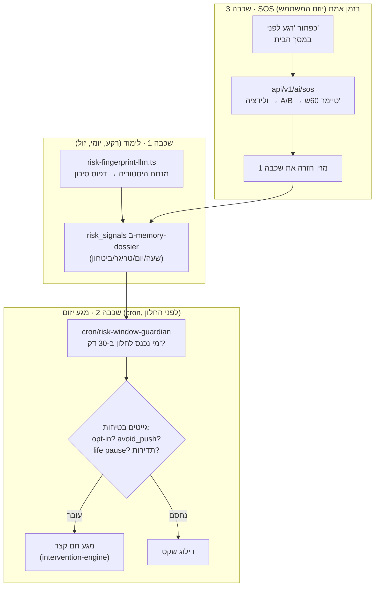

# מפרט: "רגע לפני" — שומר מניעה יזום (Pre-Lapse Guardian)

> **מסמך אפיון.** נכתב כדי שאפשר יהיה לאשר את התכונה לפני יישום, ולפתוח אותו
> ממחשב חדש בלי להסתמך על זיכרון השיחה.
>
> תאריך: 15 ביוני 2026. סטטוס: **טרם הוחל יישום** — מסמך אפיון בלבד.
>
> מקור: סקירת קוד מלאה של שכבת ה-AI הקיימת. הרעיון נבנה **מעל** נכסים בלעדיים
> שכבר קיימים ב-NuraWell (`roller-coaster`, `life-context`, `intervention-engine`,
> `avoid-push`, `memory-dossier`), ולא כמערכת חדשה.

---

## 0. TL;DR

כל אפליקציית דיאטה בשוק היא **תגובתית** — היא מגלה על נפילה *אחרי* שקרתה.
NuraWell כבר מזהה נפילות בדיעבד (`detectRelapseInMessage` ב-`roller-coaster.ts`),
אבל הקרב האמיתי מוכרע ב-15 הדקות שבהן המשתמש עומד מול המקרר בערב אחרי יום קשה —
ושם אלמוג לא נוכח.

**הרעיון:** אלמוג לומד את **"חלון הסיכון" האישי** של כל משתמש (שעה/יום/טריגר
רגשי), ומגיע באופן יזום ~20–40 דקות *לפני* החלון, עם מגע קצר, חם ותומך —
**וכן** כפתור SOS ("רגע, אני עומד ליפול") שנותן התערבות מיידית של 60 שניות.

**זה ההבדל** בין מאמן שאומר "חבל שנפלת" לבין מאמן ש"היה שם רגע לפני". זה ה-USP
הכי קשה להעתקה שיש לנו, כי הוא דורש דאטה התנהגותי בעברית לאורך זמן.

**עיקרון-על (לא לשכוח לרגע):** התכונה הזו היא **ליווי, לא טיפול**. היא
**אחראית ובטוחה ולא טיפולית** — ראה פרק 2, שהוא ה-gatekeeper של כל המסמך. שום
שכבה לא נבנית לפני שמנגנוני הבטיחות שלה קיימים.

---

## 1. רקע — מה כבר קיים בקוד (80% מהתשתית)

הכוח של הפיצ'ר הזה הוא ש**כמעט הכל כבר בנוי**. אנחנו מחברים נכסים קיימים, לא
מקימים מערכת.

| נכס קיים | קובץ | מה הוא נותן ל"רגע לפני" |
|----------|------|------------------------|
| זיהוי נפילה בצ'אט | `lib/ai/roller-coaster.ts` (`detectRelapseInMessage`, `resolveReturnVisitContext`) | אותות נפילה/ghosting/חזרה — **חומר הלימוד** לטביעת הסיכון |
| הקשר חיים | `lib/ai/life-context.ts` (`readLifeContext`, `getAlmogPushTier`) | מתי **לא** להתערב (אשפוז/אבל/משבר → `pause`) |
| מנוע התערבות | `lib/ai/almog-commitments/intervention-engine.ts` + `friction.ts` | מייצר אופציות A/B ממוקדות לפי סוג החסם — **הליבה של ה-SOS** |
| העדפת "פחות דחיפה" | `lib/ai/avoid-push.ts` (`isAvoidPushActive`, `crisisCooldownUntilIso`) | gate גלובלי + cooldown אחרי משבר |
| תיק זיכרון מובנה | `lib/ai/memory-dossier/types.ts` — שדה `risk_signals` **כבר קיים** | מקום אחסון לטביעת הסיכון, בלי מיגרציה לסכימה |
| עוגני זמן מהפרופיל | `lib/ai/profile-schedule-anchors.ts` | שעות שינה/ארוחות/עבודה — חצי מהאות לחלון הסיכון |
| פסיכולוגיית מומנטום | `lib/ai/momentum-psychology.ts` | Self-Compassion, Tiny Habits — הטון התומך, בלי אשמה |
| סגנון ליווי | `lib/ai/almog-coaching-style.ts` | warm/direct/gentle — התאמת הטון של המגע היזום |
| מנוע התראות + cron | `app/api/v1/ai/cron/habit-checkpoints/route.ts`, QStash | תשתית שליחה, dedup, web push — ה-cron החדש מחקה אותה |
| מצב מעורבות | `profiles.engagement_status` (מ-`000044`) | gating: לא מתערבים יזום במי שכבר churned |

**מה חסר (ה-gap):**
1. מנוע שלומד את **חלון הסיכון האישי** מתוך ההיסטוריה.
2. cron שמתערב **לפני** החלון (כל הקיים מתערב לפי שעת יום קבועה / בדיעבד).
3. כפתור **SOS** בזמן אמת + ה-route שמאחוריו.
4. דוקטרינת בטיחות מפורשת לפיצ'ר שנוגע ברגעי שבירות (פרק 2).

---

## 2. עיקרון-על: אחראי, בטוח, ולא טיפולי 🛡️

> זהו **הפרק החשוב במסמך**. פיצ'ר שמתערב ברגעי שבירות רגשית ובסביבת אוכל
> נושא סיכון אמיתי לגלוש לטריטוריה טיפולית/קלינית, או לחזק דפוסים מזיקים.
> כל שאר המסמך כפוף לכללים כאן. אם שכבה כלשהי מתנגשת עם פרק זה — פרק זה מנצח.

### 2.1 אלמוג הוא מלווה, לא מטפל

אלמוג הוא **חבר תומך / מאמן הרגלים**. הוא **לא** פסיכולוג, פסיכיאטר, דיאטן
קליני או רופא, ואסור לו להציג את עצמו ככזה.

**אסור באופן מוחלט:**
- לאבחן ("יש לך אכילה רגשית/דיכאון/הפרעת אכילה").
- "לטפל" במצוקה נפשית, חרדה, טראומה, או הפרעת אכילה.
- לתת ייעוץ רפואי/תרופתי/תזונתי-קליני (קלוריות, צום ממושך, דיאטות קיצון).
- ליצור תלות רגשית טיפולית ("רק אני מבין אותך", "בלעדיי תיפול").

**מותר ורצוי:**
- נוכחות חברית, ולידציה רגשית כללית, עידוד צעד קטן.
- הזכרת "למה התחלת" (מתוך ה-onboarding של המשתמש עצמו).
- הפניה למשאב אנושי/מקצועי כשצריך (ראה 2.3).

### 2.2 לא לחזק דפוסי אכילה מזיקים (Eating-Disorder Safety)

זו נקודת התורפה הכי מסוכנת בפיצ'ר. מגע "רגע לפני שאתה אוכל" עלול, אם לא נזהר,
לדחוף לעבר **שליטה אובססיבית, רגשות אשם סביב אוכל, או הגבלה מסוכנת**.

**כללי ברזל:**
1. **המסגור הוא "תמיכה", לא "שמירה/משטור".** לעולם לא "אל תאכל", "תתאפק",
   "אתה עומד לדפוק את הדיאטה". כן: "אני פה איתך רגע. בא ניקח נשימה."
2. **אפס שיפוט ואפס אשמה** — נשען על בלוק ה-Self-Compassion שכבר קיים
   ב-`MOMENTUM_PSYCHOLOGY_PROMPT_BLOCK`. אכילה היא לא "כישלון".
3. **לא לעודד הגבלה** — אסור לקדם דילוג על ארוחות, צום, או "לפצות" על אכילה.
4. **זיהוי דגלים של הפרעת אכילה** (ביטויי הקאה/הרעבה/ספירה אובססיבית/
   "מגעיל אותי הגוף שלי") → מצב `red_flag`, עצירת כל ה-nudges, הפניה רכה
   למקצועי (2.3). **לא** להמשיך "התערבות התנהגותית".
5. **אנטי-אובססיביות במוצר עצמו:** אם משתמש לוחץ SOS באופן כפייתי (למשל
   10+ פעמים ביום), זה **אות אזהרה** — לא "engagement". מורידים הילוך, מציעים
   הפסקה, ושוקלים הפניה. ראה 8.4.

### 2.3 פרוטוקול דגל אדום — Escalation, לא טיפול

זיהוי ביטויים של **סכנת חיים / מצוקה חריפה** (אובדנות, פגיעה עצמית, "אין לי
סיבה לחיות", הפרעת אכילה חמורה) מפעיל פרוטוקול קבוע:

1. **לעצור מיד** כל מגע יזום / SOS התנהגותי. לא לנסות "לפתור".
2. **תגובה אנושית קצרה + ולידציה** בלי קלישאות: "אני שומע אותך, ואני לא
   רוצה שתהיה עם זה לבד עכשיו."
3. **הפניה למשאב אנושי מיידי** (קבוע, לא LLM-generated):
   - **ער"ן — עזרה ראשונה נפשית: 1201** (24/7, חינם, אנונימי).
   - במצב סכנה מיידית: **101 / 100**.
4. **הפעלת `avoid_push` cooldown** ארוך (`crisisCooldownUntilIso`) + סימון
   `risk_signals.red_flag_at`.
5. **דיווח ops** (לא חושף PII מעבר לנדרש) דרך `send-cron-ops-notification.ts`
   כדי שצוות אנושי יוכל לעקוב אם מוגדר תהליך כזה.

> מקור האמת לרשימת מספרי החירום: קובץ קבוע `lib/safety/crisis-resources.ts`,
> **לא** מיוצר ע"י LLM (אסור שמודל ימציא מספר חירום שגוי).

### 2.4 אוטונומיה, שקיפות והסכמה (Consent & Control)

- **Opt-in, לא opt-out.** המגע היזום של "רגע לפני" מופעל רק אחרי שהמשתמש
  הסכים מפורשות (toggle בהגדרות + הסבר קצר מה זה עושה).
- **כיבוי בלחיצה אחת** + פקודה טבעית בצ'אט ("אל תשלח לי דברים כאלה") שמכבה.
- **שקיפות:** לא להעמיד פנים שזה ספונטני. מותר וכדאי: "שמתי לב שערב הוא זמן
  שלפעמים קשה לך — רציתי רק להיות פה."
- **כיבוד `life-context`:** מי שב-`pause` (אשפוז/אבל/משבר) — **אפס** מגע יזום.

### 2.5 פרטיות

- כל עיבוד LLM שמשתמש בנתוני המשתמש עובר דרך הכללים הקיימים. אם המודל הוא
  חיצוני (Qwen וכו') — **חובה** `PiiShield` (`lib/ai/privacy/pii-shield.ts`).
- `risk_signals` הוא דאטה רגיש — נשמר תחת RLS של `user_memory_dossier` (קיים),
  לא נחשף ל-client אלא במצומצם.

### 2.6 כלל הזהב לתדירות (Anti-Spam = Anti-Harm)

מגע יזום הוא חרב פיפיות. הגבלה קשיחה (פרק 8.1): **לכל היותר מגע "רגע לפני" אחד
ביום, ולא יותר מ-3 בשבוע**, וגם זה רק בחלון סיכון מובהק. ספק → לא שולחים.

---

## 3. ארכיטקטורה — שלוש שכבות



**עקרון:** כל שכבה עומדת בפני עצמה. אפשר לשחרר אותן בהדרגה (פרק 11). שכבה 3
(SOS) היא בעלת ה-ROI הגבוה והסיכון הנמוך ביותר — **מתחילים ממנה**.

---

## 4. שכבה 1 — לימוד טביעת הסיכון (Risk Fingerprint)

### 4.1 מטרה
לבנות לכל משתמש דפוס: *מתי* הוא בסיכון, *מה* הטריגר, ו*מה כבר עזר/לא עזר*.

### 4.2 קלט (מה מנתחים)
- `ai_interactions` — הודעות עם אות נפילה (`detectRelapseInMessage`), חתומות
  בזמן (שעה ביום, יום בשבוע, אזור זמן ישראל).
- `journey_task_executions` — דפוסי החמצה (`outcome != 'completed'`) לפי שעה.
- `almog_interventions` — מה כבר נוסה והאם עזר (`fetchInterventionMemory`).
- `profile-schedule-anchors` — עוגני שינה/ארוחות/עבודה.
- `life-context` — להוצאת תקופות `pause` מהלמידה (לא מזהמים את הדפוס).

### 4.3 פלט — מבנה `risk_signals` (בתוך `user_memory_dossier`)

```typescript
// נשמר תחת user_memory_dossier.risk_signals (השדה כבר קיים בסכימה)
type RiskFingerprint = {
  /** חלונות סיכון מובהקים — ממוינים לפי ביטחון */
  windows: Array<{
    /** 0=ראשון … 6=שבת. null = כל יום */
    weekday: number | null;
    /** "HH:MM" שעת תחילת החלון (זמן ישראל) */
    start_hhmm: string;
    /** משך בדקות */
    duration_min: number;
    /** קטגוריית הטריגר — מהטקסונומיה הקיימת ב-friction.ts */
    trigger: FrictionCategory; // emotional | logistical | ...
    /** 0..1 — נשלח מגע יזום רק מעל סף (ברירת מחדל 0.6) */
    confidence: number;
    /** כמה אירועים תומכים בדפוס (שקיפות + סף מינימלי) */
    sample_size: number;
  }>;
  /** מה כבר עזר היסטורית — להזנת ה-SOS */
  helped_strategies: StrategyType[];
  /** דגלי בטיחות */
  red_flag_at?: string | null;
  ed_caution?: boolean; // אות זהירות להפרעת אכילה — מוריד הילוך
  /** מטא */
  computed_at: string;
  model: string;
};
```

### 4.4 לוגיקה
- רץ **יומי** ב-cron (slot לילה, עומס נמוך), על משתמשים פעילים בלבד.
- **דטרמיניסטי קודם, LLM רק לחידוד:** ספירת תדירויות לפי שעה/יום נעשית בקוד
  (זול, יציב). LLM (Groq/Llama — `AI_MODELS.background_groq`) רק כדי לתייג
  טריגר ולנסח, בדומה ל-`intervention-engine`.
- **סף מינימלי:** חלון נכנס רק עם `sample_size >= 3` ו-`confidence >= 0.6`.
  אין מספיק דאטה → אין חלון → אין מגע יזום (failsafe ל-false positives).
- **ניקוי דגלים:** אם זוהה `ed_caution`/`red_flag` — לא מייצרים חלונות מגע
  התנהגותי כלל (פרק 2.2/2.3).

### 4.5 קבצים
- חדש: `apps/web/lib/ai/risk-fingerprint-llm.ts` — חילוץ + תיוג.
- חדש: `apps/web/lib/ai/risk-window.ts` — טיפוסים + `isInRiskWindowSoon()`.
- חדש: `apps/web/app/api/v1/ai/cron/risk-fingerprint/route.ts` — ה-cron היומי.
- שימוש קיים: `memory-dossier/*`, `roller-coaster.ts`, `friction.ts`,
  `intervention-engine.ts` (`fetchInterventionMemory`).

---

## 5. שכבה 2 — מגע יזום לפני החלון (Proactive Touch)

### 5.1 מטרה
להגיע ~20–40 דקות לפני חלון סיכון מובהק, עם מגע **קצר, חברי, לא-משימתי**.

### 5.2 זרימה
1. cron רץ כל ~30 דקות (QStash), שולף משתמשים עם `risk_signals.windows`.
2. לכל משתמש: `isInRiskWindowSoon(now, windows, leadMin=30)`.
3. **שרשרת גייטים (כולן חייבות לעבור):**

```typescript
function guardianTouchAllowed(ctx): GuardianGateResult {
  if (!ctx.optedIn)                       return block('not_opted_in');     // 2.4
  if (isAvoidPushActive(ctx.aiContext))   return block('avoid_push');       // קיים
  if (getAlmogPushTier(ctx.aiContext) === 'minimal') return block('life_pause'); // 2.4
  if (ctx.riskSignals.red_flag_at)        return block('red_flag');         // 2.3
  if (ctx.engagementStatus === 'churned') return block('churned');          // לא לרדוף
  if (!frequencyAllowed(ctx))             return block('frequency_cap');    // 2.6 / 8.1
  if (ctx.userRespondedWithin(hours: 3))  return block('recently_active');  // כבר פה
  if (ctx.window.confidence < THRESHOLD)  return block('low_confidence');
  return allow();
}
```

4. עובר → בונים מגע: `intervention-engine` מספק רעיון A/B לפי `window.trigger`
   ו-`helped_strategies`; הטון לפי `almog-coaching-style` + `momentum-psychology`.
5. Insert ל-`notifications` עם `metadata.source = 'almog_pre_lapse_guardian'`,
   `expects_reply: true`.

### 5.3 דוגמת מגע (לרוח — ה-LLM מנסח מקורי)
> "היי דני 💙 חמישי בערב — זמן שלפעמים קצת כבד אחרי שבוע עמוס. לא בא לדבר על
> תוכניות. רק כוס מים קרים ונשימה ארוכה איתי, 30 שניות. אתה איתי?"

**אסור** (פרק 2): "אל תאכל", "תיזהר מהמקרר", "אתה עומד לדפוק את הדיאטה".

### 5.4 קבצים
- חדש: `apps/web/app/api/v1/ai/cron/risk-window-guardian/route.ts`
- חדש: `apps/web/lib/ai/guardian/guardian-gates.ts` — שרשרת הגייטים (5.2).
- חדש: `apps/web/lib/ai/guardian/build-guardian-touch.ts` — בניית ההודעה.
- שימוש קיים: `avoid-push.ts`, `life-context.ts`, `intervention-engine.ts`,
  `almog-coaching-style.ts`, `notify-user-profile.ts`, web push.

---

## 6. שכבה 3 — כפתור SOS "רגע לפני" (הקליימקס) ⭐

> זו השכבה עם הערך הגבוה והסיכון הנמוך ביותר, ולכן **נקודת הפתיחה המומלצת**.

### 6.1 חוויה
- כפתור קבוע ועדין במסך הבית (לא מבהיל): "רגע, קשה לי עכשיו".
- לחיצה → דיאלוג קצר של אלמוג במצב חירום-רך של ~60 שניות:
  1. **ולידציה מיידית** ("יופי שאמרת. זה אומץ. אני פה.").
  2. **שאלה אחת קצרה** — מה קורה? (3 כפתורים מהירים: "לחוץ" / "משעמם" /
     "סתם מתחשק" → ממופים ל-`FrictionCategory`, בלי לחייב הקלדה).
  3. **צעד A/B מ-`intervention-engine`** לפי הטריגר ("נשתה מים ונדבר 2 דקות" /
     "נצא ל-5 דקות אוויר").
  4. **טיימר/עוגן קצר** + סגירה חמה ("עברת את הרגע. זה הכל. גאה בך 💙").

### 6.2 בטיחות ב-SOS (קריטי)
- **סריקת דגל אדום** על כל קלט חופשי לפני כל דבר אחר (פרק 2.3). זוהה → מצב
  escalation, **לא** המשך התערבות התנהגותית.
- **anti-loop:** SOS אינו מסך שאפשר "להיתקע" בו. מקסימום סבב אחד; בסוף תמיד
  סגירה + הצעה לפנות לאדם אם זה חוזר.
- **anti-obsession:** מעקב `sos_count_today`. מעל סף (ברירת מחדל 6) → אלמוג
  מוריד הילוך בעדינות ומציע הפסקה/הפניה (פרק 8.4), **לא** עוד התערבות.
- כל לחיצת SOS = אירוע למידה לשכבה 1 (חומר זהב לדיוק הניבוי).

### 6.3 קבצים
- חדש: `apps/web/app/api/v1/ai/sos/route.ts` — runtime edge, streaming.
- חדש: `apps/web/components/ai/SosButton.tsx` + `SosDialog.tsx`.
- חדש: `apps/web/lib/safety/crisis-detector.ts` — זיהוי דגל אדום (regex +
  סיווג, edge-safe).
- חדש: `apps/web/lib/safety/crisis-resources.ts` — מספרי חירום קבועים (ער"ן
  1201 וכו'), **לא** LLM.
- שימוש קיים: `intervention-engine.ts`, `momentum-psychology.ts`,
  `coaching-style`, `insert-ai-interaction.ts`.

---

## 7. מודל נתונים

### 7.1 אין טבלה חדשה גדולה — נשענים על הקיים
- **טביעת הסיכון:** `user_memory_dossier.risk_signals` (JSONB, **קיים** מ-`000043`).
- **מצב/דגלים פר-יוזר:** `profiles.ai_context` (JSONB, קיים) — toggle ה-opt-in
  והעדפות.
- **מגעים/SOS:** `notifications` (קיים) — מקור אמת לתדירות.

### 7.2 מיגרציה `000052_pre_lapse_guardian.sql` (מינימלי)

```sql
-- אירועי SOS — מקור אמת ללמידה, anti-obsession, ו-analytics.
CREATE TABLE IF NOT EXISTS public.guardian_sos_events (
  id UUID PRIMARY KEY DEFAULT gen_random_uuid(),
  user_id UUID NOT NULL REFERENCES public.profiles(id) ON DELETE CASCADE,
  trigger TEXT,                 -- FrictionCategory מזוהה
  strategy_offered TEXT,        -- StrategyType שהוצע
  outcome TEXT,                 -- 'passed' | 'fell' | 'unknown' | 'escalated'
  red_flag BOOLEAN NOT NULL DEFAULT FALSE,
  date_key TEXT NOT NULL,       -- YYYY-MM-DD לפי ירושלים (anti-obsession count)
  created_at TIMESTAMPTZ NOT NULL DEFAULT NOW()
);

CREATE INDEX IF NOT EXISTS idx_guardian_sos_user_date
  ON public.guardian_sos_events (user_id, date_key);

ALTER TABLE public.guardian_sos_events ENABLE ROW LEVEL SECURITY;

CREATE POLICY guardian_sos_insert_own ON public.guardian_sos_events
  FOR INSERT TO authenticated WITH CHECK (auth.uid() = user_id);
CREATE POLICY guardian_sos_select_own ON public.guardian_sos_events
  FOR SELECT TO authenticated USING (auth.uid() = user_id);
```

### 7.3 `ai_context` — הרחבה (בלי מיגרציה)

```typescript
type GuardianContext = {
  opted_in: boolean;            // 2.4 — ברירת מחדל false
  opted_in_at?: string;
  last_guardian_touch_at?: string;
  guardian_touches_this_week?: number;
  muted_until?: string;         // "תן לי רגע"
};
```

### 7.4 `notifications.metadata` — מקורות חדשים

```typescript
source: 'almog_pre_lapse_guardian' | 'almog_sos';
guardian?: { window_trigger: FrictionCategory; confidence: number; lead_min: number };
```

---

## 8. בטיחות תפעולית — גבולות קשיחים

### 8.1 תדירות (Hard Caps)

```text
מגע יזום (שכבה 2):  ≤ 1 ביום,  ≤ 3 בשבוע,  ורק confidence ≥ 0.6
SOS (שכבה 3):       יוזם המשתמש — ללא חסם כניסה, אבל מעל 6/יום → מצב הורדת הילוך (8.4)
דגל אדום:            עוצר הכל מיידית (פרק 2.3)
```

אכיפה: gate קשיח מול `notifications` + `guardian_sos_events` **לפני** כל insert.
מקור האמת הוא ה-DB (כמו ב-churn spec), לא cache.

### 8.2 כיבוד מצבי חיים
`getAlmogPushTier === 'minimal'` (pause: אשפוז/אבל/משבר) → אפס מגע יזום. זה
מנגנון קיים ב-`life-context.ts`, רק צריך לחווט אותו לגייט.

### 8.3 Failsafe ל-false positives
ספק לגבי החלון, דאטה דליל, או `confidence` נמוך → **לא שולחים**. עדיף לפספס
חלון מאשר להטריד או לתייג מישהו בטעות כ"בסיכון".

### 8.4 Anti-Obsession (שימוש כפייתי ב-SOS)
שימוש מוגזם ב-SOS הוא **דגל, לא הצלחה**:
- 6+ SOS ביום → אלמוג עובר לטון מרגיע, מפסיק להציע "עוד צעד", ומציע:
  "אני שם לב שהיום ממש קשה. אולי שווה לדבר עם מישהו אנושי על זה?" + משאב (2.3).
- דפוס מתמשך (כמה ימים) → סימון `risk_signals.ed_caution` ושקילת הפניה.

### 8.5 ניטור
- מטריקת `guardian_touch_complaints` (משתמשים שכיבו אחרי מגע).
- `sos_red_flag_rate` — ניטור צמוד; כל דגל אדום נרשם ל-ops.
- אם תלונות > סף → kill switch אוטומטי (פרק 11).

---

## 9. שינויי קוד — סיכום פר-קובץ

### קבצים חדשים
| קובץ | תפקיד |
|------|--------|
| `lib/safety/crisis-detector.ts` | זיהוי דגל אדום (regex + סיווג), edge-safe |
| `lib/safety/crisis-resources.ts` | מספרי חירום קבועים (ער"ן 1201, 101/100) |
| `lib/ai/risk-window.ts` | טיפוסי `RiskFingerprint` + `isInRiskWindowSoon` |
| `lib/ai/risk-fingerprint-llm.ts` | לימוד טביעת הסיכון (שכבה 1) |
| `lib/ai/guardian/guardian-gates.ts` | שרשרת גייטי הבטיחות (5.2) |
| `lib/ai/guardian/build-guardian-touch.ts` | בניית המגע היזום |
| `app/api/v1/ai/cron/risk-fingerprint/route.ts` | cron יומי (שכבה 1) |
| `app/api/v1/ai/cron/risk-window-guardian/route.ts` | cron ~30ד' (שכבה 2) |
| `app/api/v1/ai/sos/route.ts` | route ל-SOS (שכבה 3) |
| `components/ai/SosButton.tsx`, `SosDialog.tsx` | UI ה-SOS |
| `components/settings/GuardianOptInToggle.tsx` | opt-in + כיבוי (2.4) |

### קבצים קיימים להרחבה
| קובץ | שינוי |
|------|--------|
| `lib/ai/memory-dossier/types.ts` | חידוד `risk_signals` ל-`RiskFingerprint` |
| `lib/ai/memory.ts` (`AiUserContext`) | הוספת `GuardianContext` ל-`ai_context` |
| `lib/ai/avoid-push.ts` | שימוש חוזר ב-`isAvoidPushActive` בגייט (אין שינוי לוגי) |
| `app/api/v1/ai/chat/route.ts` | חיווט פקודת כיבוי טבעית ("אל תשלח לי כאלה") |
| `docs/CRON_SCHEDULES_SETUP.md` | הוספת שני ה-crons החדשים |

---

## 10. מדדי הצלחה (KPIs)

| מדד | חישוב | למה אכפת לנו |
|-----|--------|--------------|
| **Pre-lapse save rate** | % חלונות עם מגע שלא הסתיימו בנפילה מדווחת, מול קבוצת ביקורת (A/B) | הוכחת ה-USP |
| **SOS completion** | % לחיצות SOS שהסתיימו ב-`outcome='passed'` | האם ההתערבות עובדת |
| **Retention 30d** | שימור עם הפיצ'ר מול בלי | הערך העסקי |
| **Opt-in rate** | % שמפעילים את המגע היזום | קבלה של המשתמשים |
| **Complaint/mute rate** | % שכיבו אחרי מגע | **מדד בטיחות** — חייב להישאר נמוך |
| **Red-flag handling** | % דגלים שקיבלו escalation תקין | **מדד בטיחות קריטי** |

> **מסר למשקיעים:** *"המוצר היחיד שמונע נפילות במקום לתעד אותן."* — אבל רק
> אם מדדי הבטיחות (השתיים האחרונות) ירוקים.

---

## 11. Feature Flags ושלבי גלגול

```bash
GUARDIAN_SOS_ENABLED=0            # שכבה 3 — מתחילים מכאן
GUARDIAN_FINGERPRINT_ENABLED=0   # שכבה 1
GUARDIAN_PROACTIVE_ENABLED=0     # שכבה 2 — אחרון, הכי רגיש
GUARDIAN_ROLLOUT_PERCENT=0       # gradual rollout לפי hash(userId)
GUARDIAN_KILL_SWITCH=0           # עצירת חירום של כל מגע יזום (8.5)
```

### סדר גלגול מומלץ (מהבטוח לרגיש)
| שלב | מה | קריטריון המשך |
|-----|----|--------------| 
| **0 — Spec** | מסמך זה + אישור | אישור מוצר + סבב בטיחות |
| **1 — Safety core** | `crisis-detector` + `crisis-resources` + escalation, **לבד** | זיהוי דגל אדום עובד ב-100% מהבדיקות |
| **2 — SOS** | שכבה 3, opt-in, 10% | `sos_completion` חיובי, אפס באג בטיחות |
| **3 — Fingerprint** | שכבה 1 (לומד בלבד, לא שולח) | טביעות נראות סבירות בבדיקה ידנית |
| **4 — Proactive** | שכבה 2, 10% → 50% → 100% | complaint rate < סף, save rate חיובי |
| **5 — Optimize** | כיול ספים, A/B על ניסוחים | — |

### Rollback
- `GUARDIAN_KILL_SWITCH=1` → עוצר כל מגע יזום + SOS מיידית.
- כל הדגלים default `0` — אין סיכון בפריסת הקוד עצמו.
- אין breaking change ל-DB (טבלה חדשה + JSONB אופציונלי).

---

## 12. בדיקות (Vitest)

| קובץ | מה בודק |
|------|---------|
| `tests/crisis-detector.test.ts` | **קריטי** — זיהוי דגלים אדומים, אפס false-negative על ביטויי סכנה |
| `tests/risk-window.test.ts` | `isInRiskWindowSoon`, ספי confidence/sample_size |
| `tests/guardian-gates.test.ts` | כל גייט חוסם נכון (avoid_push, pause, frequency, red_flag, churned) |
| `tests/guardian-frequency.test.ts` | hard caps: 1/יום, 3/שבוע |
| `tests/sos-anti-obsession.test.ts` | מעבר למצב הורדת הילוך מעל סף |
| `tests/risk-fingerprint-llm.test.ts` | חילוץ דטרמיניסטי, ניקוי תקופות `pause` |

> דגש: בדיקות הבטיחות (`crisis-detector`, `guardian-gates`) הן **חוסמות שחרור**
> — לא משחררים שום שכבה אם הן לא ירוקות.

---

## 13. סיכונים והחלטות פתוחות

| סיכון | מיטיגציה |
|-------|----------|
| גלישה לטריטוריה טיפולית | פרק 2 כ-gatekeeper; ניסוח "מלווה לא מטפל" בכל פרומפט |
| חיזוק הפרעת אכילה | 2.2 + `ed_caution` + anti-obsession (8.4) |
| מגע יזום מרגיש "מפחיד"/חודרני | opt-in (2.4) + שקיפות + caps תדירות (8.1) |
| false positive בחלון | סף sample_size≥3 + confidence≥0.6 + failsafe (8.3) |
| דגל אדום שפוספס | בדיקות חוסמות-שחרור + ניטור `sos_red_flag_rate` |
| עלות LLM | דטרמיניסטי-קודם; LLM רק על Groq זול ורק כשצריך |

**החלטות פתוחות לאישור מוצר:**
1. ניסוח מדויק של ה-opt-in (איפה בהגדרות, איזה copy).
2. האם להפעיל escalation ops גם בלי תהליך אנושי מוגדר (כרגע: כן, ללוג).
3. סף ה-anti-obsession (6/יום — לכיול).
4. האם שכבה 2 דורשת אישור נוסף מעבר ל-opt-in הכללי.

---

## 14. Definition of Done

התכונה מוכנה כאשר:
- [ ] `crisis-detector` + escalation עובדים ועוברים 100% מבדיקות הבטיחות.
- [ ] משאבי החירום קבועים בקוד (לא LLM) ומוצגים נכון.
- [ ] SOS: opt-in, סבב יחיד, anti-obsession, מזין למידה.
- [ ] שכבה 1 מייצרת `risk_signals` עם ספי מינימום ומנקה תקופות `pause`.
- [ ] שכבה 2 עוברת את **כל** שרשרת הגייטים לפני שליחה.
- [ ] caps תדירות נאכפים מול ה-DB.
- [ ] כל מגע מכבד `avoid_push` ו-`life-context`.
- [ ] kill switch + feature flags עובדים.
- [ ] מדדי בטיחות (complaint/mute, red-flag) מנוטרים.
- [ ] בדיקות הבטיחות ירוקות (חוסמות שחרור).

---

## 15. הערת המשכיות

כשמתחילים יישום, לקרוא קודם (לפי סדר):
1. `lib/ai/roller-coaster.ts` — איך מזוהה נפילה היום.
2. `lib/ai/life-context.ts` — `getAlmogPushTier`, מצבי `pause`.
3. `lib/ai/avoid-push.ts` — הגייט הקיים.
4. `lib/ai/almog-commitments/intervention-engine.ts` + `friction.ts` — ליבת A/B.
5. `lib/ai/memory-dossier/types.ts` — שדה `risk_signals`.
6. `lib/ai/momentum-psychology.ts` + `almog-coaching-style.ts` — הטון.
7. `app/api/v1/ai/cron/habit-checkpoints/route.ts` — תבנית ל-cron.

**ההתחלה הכי בטוחה:** שלב 1 (Safety core) → שלב 2 (SOS). אל תיגע במגע היזום
(שכבה 2) לפני ששתי אלה יציבות ומנוטרות.

---

*סוף מסמך. כל שכבה כפופה לפרק 2. לשינויי מוצר — לעדכן סטטוס בראש המסמך לפני יישום.*
